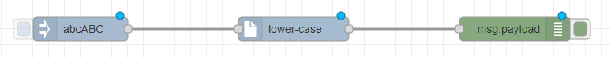
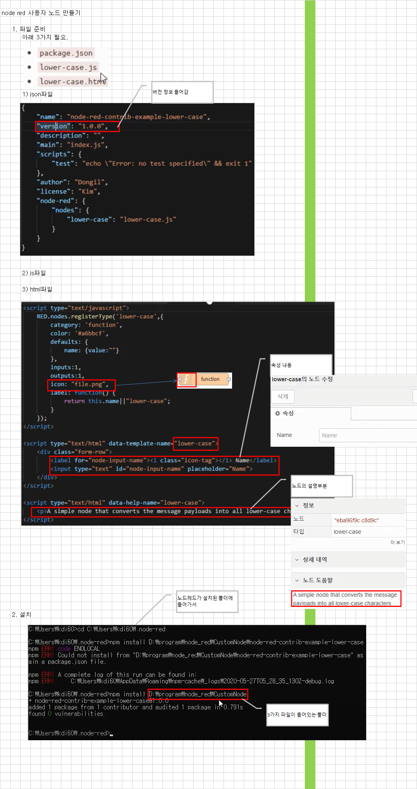

# node-red 사용자 노드 만들기
가이드 문서 [링크](https://nodered.org/docs/creating-nodes/first-node)  
HTML 작성법 [링크](https://nodered.org/docs/creating-nodes/node-html)
  
### 사용자 노드 생성
주의할점은 사용자 노드 모듈 이름에 node-red가 들어가길 원한다면 폴더명 접두어로 `node-red-contrib-`을 붙여야한다.  
node-red을 포함하지 않길 원한다면 접두어로 어떠한 이름을 사용해도 상관없다.

```bash
$ mkdir node-red-contrib-example-lower-case
$ cd node-red-contrib-example-lower-case
$ npm init
```

생성된 디렉터리에 규칙에 맞춰서 html과 js 파일을 작성한다.  
그리고 package.json 파일에 값을 설정한다.
```json
// "lower-case": "lower-case.js"는 노드 이름 lower-case는 lower-case.js 코드 파일과 연결됨 
{
    "name": "node-red-contrib-example-lower-case",
    "version": "1.0.0",
    "description": "",
    "main": "index.js",
    "scripts": {
        "test": "echo \"Error: no test specified\" && exit 1"
    },
    "author": "Dongil",
    "license": "Kim",
    "node-red": {
        "nodes": {
            "lower-case": "lower-case.js" 
        }
    }
}
```

### 사용자 노드 설치
node-red 디렉터리로 이동한 후 생성한 사용자 노드를 설치한다.
```bash
$ cd ~/.node-red
$ npm install <디렉터리경로>/node-red-contrib-example-lower-case # 사용자 node 설치
```

node-red 디렉터리의 package.json에 사용자 노드가 설치되어 있는지 확인한다.
```bash
$ cd ~/.node-red
$ cat package.json

{
    "name": "node-red-project",
    "description": "A Node-RED Project",
    "version": "0.0.1",
    "private": true,
    "dependencies": {
        "node-red-contrib-example-lower-case": "file:../Desktop/node-red/project-06/node-red-contrib-example-lower-case",
        "node-red-dashboard": "~2.28.1"
    }
}

```
node-red 실행시 다음과 같이 flow 오브젝트를 활용할 수 있으면 성공적으로 반영된 것이다.  


### 사용자 노드 생성시 파일 역할 설명

