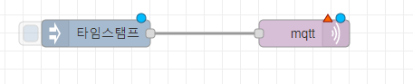
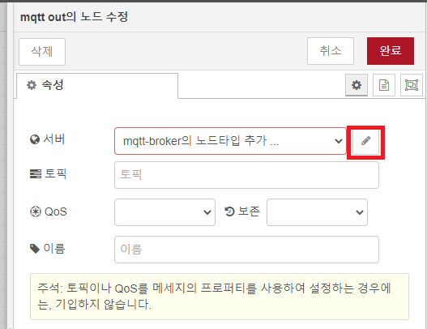
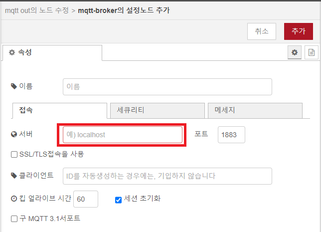
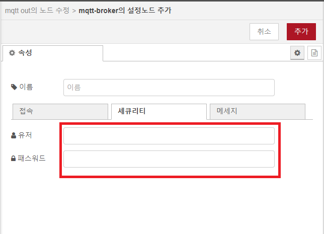
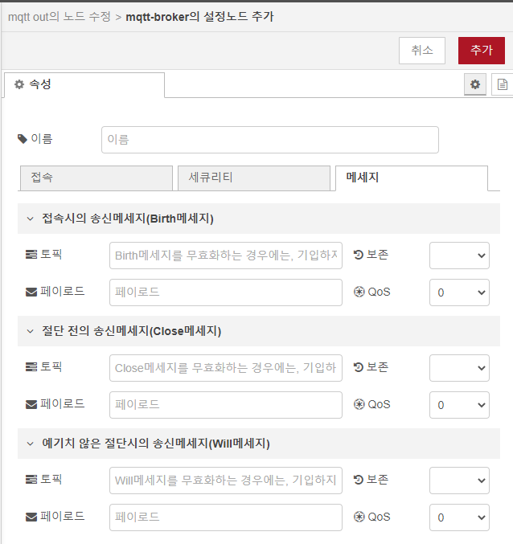
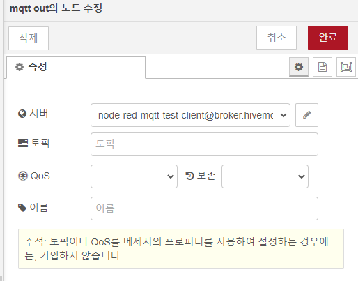
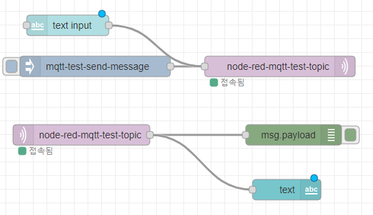

# node-red mqtt 통신시작
## 1. mqtt 연결 설정
mqtt를 직접 설치하고 테스트하려면 [http://www.mqtt-dashboard.com/](http://www.mqtt-dashboard.com/)을 이용한다.

### 1-1. 대쉬보드에서 다음과 같이 mqtt 플로우를 구성한다.  
  

### 1-2. mqtt 연결 정보를 설정한다.  
  
연결 정보를 설정한다.  
클라이언트 아이디는 반드시 필요하여(자동으로 생성이면 입력하지 않음) 고유한 값으로 입력해야 한다.  
  

보안을 위한 시큐리티 정보가 있으면 설정한다.  
  

메시지 탭에서 설정할 것이 있으면 설정한다.  
  

데이터를 발행하고 구독하기 위한 토픽값을 입력한다.  
  
  
플로우를 다음과 같이 구성하고 잘 동작하는지 테스트한다.  
  